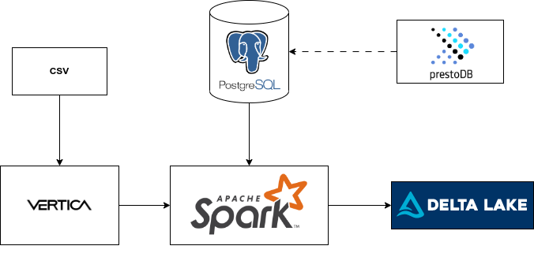
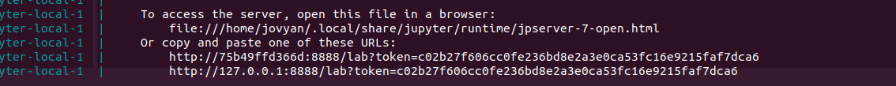
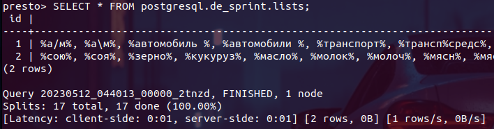
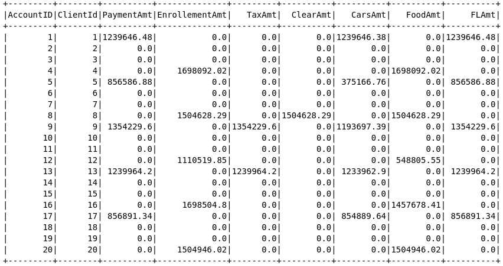
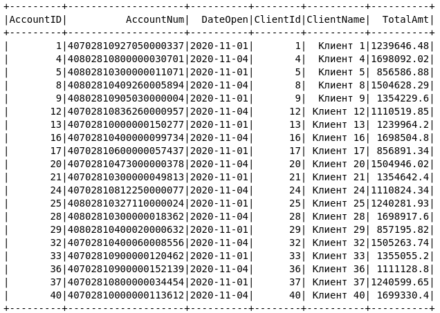
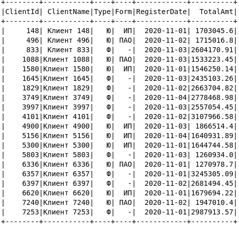

# Клиенты и счета.

<div align="center">


</div>

## Постановка задачи

Все операции должны считаться локально.

По итогу должно получиться 3 витрины с 4 днями. Каждая витрина – один паркет. Паркетники, как и код необходимо выложить на гитхаб. Технологический стек – sql, scala, python. Если спарк будет работать медленно – данные необходимо уменьшить.

<details>
  <summary>Исходные таблицы ниже</summary>

1. **Таблица клиентов 10 000 записей**

    |Поле|Описание|
    |-----------|-----------|
    |ClientId|ИД клиента (PK)|
    |ClientName|Наименование клиента|
    |Type|Тип клиента (ФЛ, ЮЛ)|
    |Form|Организационно-правовая форма (ООО, ИП и т.п.)|
    |RegisterDate|Дата регистрации клиента|

2. **Таблица счетов – 20 000 записей**

    |Поле|Описание|
    |-----------|-----------|
    |AccountId|ИД  счета (PK)|
    |AccountNum|Двадцатизначный номер счета|
    |ClientId|ИД клиента владельца счета (FK)|
    |DateOpen|Дата открытия счета|
 

3. **Операции по счетам – 100 000 записей**

    |Поле|Описание|
    |-----------|-----------|
    |AccountDB|Счет дебета проводки (FK)|
    |AccountCR|Счет кредита проводки (FK)|
    |DateOp|Дата операции|
    |Amount|Сумма операции|
    |Currency|Валюта операции|
    |Comment|Назначение платежа|

4. **Курсы валют по отношению к рублю**

    |Поле|Описание|
    |-----------|-----------|
    |Currency|Валюта|
    |Rate|Курс|
    |RateDate|Дата курса|

**Необходимо сформировать три витрины на следующие даты:**

**2020-11-01, 2020-11-02, 2020-11-03, 2020-11-04.**

Минимум можно сделать только на одну дату **2020-11-01**.

1. **Витрина** _corporate_payments_. Строится по каждому уникальному счету (AccountDB  и AccountCR) из таблицы Operation. Ключ партиции CutoffDt

    |Поле|Описание|
    |-----------|-----------|
    |AccountId|ИД счета|
    |ClientId|Ид клиента счета|
    |PaymentAmt|Сумма операций по счету, где счет клиента указан в дебете проводки|
    |EnrollementAmt|Сумма операций по счету, где счет клиента указан в  кредите проводки|
    |TaxAmt|Сумму операций, где счет клиента указан в дебете, и счет кредита 40702|
    |ClearAmt|Сумма операций, где счет клиента указан в кредите, и счет дебета 40802|
    |CarsAmt|Сумма операций, где счет клиента указан в дебете проводки и назначение платежа не содержит слов по маскам Списка 1|
    |FoodAmt|Сумма операций, где счет клиента указан в кредите проводки и назначение платежа содержит слова по Маскам Списка 2|
    |FLAmt|Сумма операций с физ. лицами. Счет клиента указан в дебете проводки, а клиент в кредите проводки – ФЛ.|
    |CutoffDt|Дата операции;|

2. **Витрина** _corporate_account_. Строится по каждому уникальному счету из таблицы Operation на заданную дату расчета. Ключ партиции CutoffDt

    |Поле|Описание|
    |-----------|-----------|
    |AccountID|ИД счета|
    |AccountNum|Номер счета|
    |DateOpen|Дата открытия счета|
    |ClientId|ИД клиента|
    |ClientName|Наименование клиента|
    |TotalAmt|Общая сумма оборотов по счету. Считается как сумма PaymentAmt и EnrollementAmt|
    |CutoffDt|Дата операции|

3. **Витрина** _corporate_info_. Строится по каждому уникальному клиенту из таблицы Operation. Ключ партиции CutoffDt

    |Поле|Описание|
    |-----------|-----------|
    |ClientId|ИД клиента (PK)|
    |ClientName|Наименование клиента|
    |Type|Тип клиента (ФЛ, ЮЛ)|
    |Form|Организационно-правовая форма (ООО, ИП и т.п.)|
    |RegisterDate|Дата регистрации клиента|
    |TotalAmt|Сумма операций по всем счетам клиент. Считается как сумма corporate_account.total_amt по всем счетам.|
    |CutoffDt|Дата операции|

Суммы должны быть в национальной валюте, для перевода использовать самый актуальный курс из таблицы курсов.

Таблица списков должна загружаться из постгреса в спарк (локально).

**Список 1:**

%а/м%, %а\м%, %автомобиль %, %автомобили %, %транспорт%, %трансп%средс%, %легков%, %тягач%, %вин%, %vin%,%viн:%, %fоrd%, %форд%,%кiа%, %кия%, %киа%%мiтsuвisнi%, %мицубиси%, %нissан%, %ниссан%, %sсанiа%, %вмw%, %бмв%, %аudi%, %ауди%, %jеер%, %джип%, %vоlvо%, %вольво%, %тоyота%, %тойота%, %тоиота%, %нyuнdаi%, %хендай%, %rенаulт%, %рено%, %реugеот%, %пежо%, %lаdа%, %лада%, %dатsuн%, %додж%, %меrсеdеs%, %мерседес%, %vоlкswаgен%, %фольксваген%, %sкоdа%, %шкода%, %самосвал%, %rover%, %ровер%

**Список 2:**

%сою%, %соя%, %зерно%, %кукуруз%, %масло%, %молок%, %молоч%, %мясн%, %мясо%, %овощ%, %подсолн%, %пшениц%, %рис%, %с/х%прод%, %с/х%товар%, %с\х%прод%, %с\х%товар%, %сахар%, %сельск%прод%, %сельск%товар%, %сельхоз%прод%, %сельхоз%товар%, %семен%, %семечк%, %сено%, %соев%, %фрукт%, %яиц%, %ячмен%, %картоф%, %томат%, %говя%, %свин%, %курин%, %куриц%, %рыб%, %алко%, %чаи%, %кофе%, %чипс%, %напит%, %бакале%, %конфет%, %колбас%, %морож%, %с/м%, %с\м%, %консерв%, %пищев%, %питан%, %сыр%, %макарон%, %лосос%, %треск%, %саир%, % филе%, % хек%, %хлеб%, %какао%, %кондитер%, %пиво%, %ликер%

**Источник:** https://disk.yandex.ru/d/OlYnCPLK4XfHVA

</details>

## План реализации

### Используемые технологии
Технологический стек – Apache Spark 3.3.1, Python 3.10, PostgreSQL 14.2, Vertica Analytic Database v9.0.0-0, Presto server 0.280.

В качестве файловой системы используется обычная файловая система хостовой машины.

### Схема



### Настройка и запуск

Для запуска используйте команду
```bash
make up-build
```
После выполнения предыдущей команды в терминале должна появиться ссылка на jupyter ноутбук



Чтобы появилась эта ссылка, можно отдельно выполнить команду
```bash
make get-jupyter-token
```

Перейдите по данной ссылке в папку work и откройте project.ipynb


#### Vertica

Данные могут грузиться как из CSV файлов, так и из Vertica. Для настройки последней необходимо запустить скрипт [init.sql](./vertica/init.sql)

#### Delta lake

Используется версия pyspark==3.3.1 и delta-spark==2.3.0

#### PostgreSQL

PostgreSQL запускается с помощью [docker-compose.yml](./docker-compose.yml)

### Presto

Просмотреть содержимое таблиц из Postgres можно с помощью Presto. Для установки сервера и коннектора будем следовать инструкциям

1. https://prestodb.io/docs/current/installation.html

2. https://prestodb.io/docs/current/connector/postgresql.html

Или просто скачаем сервер и клиент
[presto-server-0.280.tar.gz](https://repo1.maven.org/maven2/com/facebook/presto/presto-server/0.280/presto-server-0.280.tar.gz)
[presto-cli-0.280-executable.jar](https://repo1.maven.org/maven2/com/facebook/presto/presto-cli/0.280/presto-cli-0.280-executable.jar)

Распакуем tar файл, скопируем туда содержимое каталога [etc](./presto). Затем переименуем presto-cli-0.280-executable.jar в presto, установим флаг chmod +x и запустим

```bash
./bin/launcher start
./presto --server localhost:8080

presto> SHOW SCHEMAS FROM postgresql;
presto> SHOW TABLES FROM postgresql.de_sprint;
presto> SELECT * FROM postgresql.de_sprint.lists;

./bin/launcher stop 
```



## Результаты разработки
В результате был создан проект со следующей структурой:
```bash
.
├── data                       # data files
├── docs                       # documentation
├── images                     # screenshots
├── jars                       # jar files
├── jupyter-local              # jupyter notebook
├── postgres                   # postgres scripts
├── src                        # python scripts
├── vertica                    # vertica scripts
└── README.md
```

<details>
  <summary>Примеры витрин данных</summary>

1. Витрина corporate_payments

    

2. Витрина corporate_account

    

2. Витрина corporate_info

    


</details>
